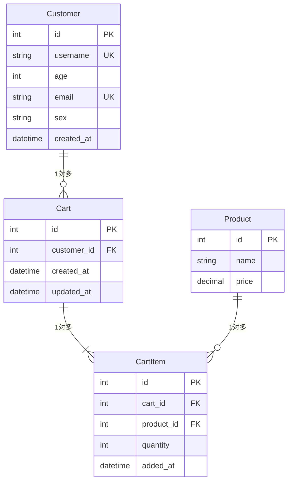

# カート機能実装報告書

## 実装概要

**実装日**: 2025-11-19  
**Issue**: Customerごとの「カートに入れる」機能を実装する  
**ステータス**: ✅ 完了

---

## ER図



---

## 実装内容

### 1. モデルの実装

#### 1.1 Customerモデル
**ファイル**: `store/models.py`

```python
class Customer(models.Model):
    """顧客モデル - age, email, sexプロパティを持つ"""
    SEX_CHOICES = [
        ('M', '男性'),
        ('F', '女性'),
        ('O', 'その他'),
    ]
    
    username = models.CharField(max_length=100, unique=True)
    age = models.IntegerField()
    email = models.EmailField(unique=True)
    sex = models.CharField(max_length=1, choices=SEX_CHOICES)
    created_at = models.DateTimeField(auto_now_add=True)
```

**特徴**:
- `username`と`email`はユニーク制約あり
- `sex`は選択肢('M', 'F', 'O')から選択
- `age`, `email`, `sex`のプロパティを要件通り実装

#### 1.2 Cartモデル
**ファイル**: `store/models.py`

```python
class Cart(models.Model):
    """カートモデル - Customer単位で管理"""
    customer = models.ForeignKey(Customer, on_delete=models.CASCADE, related_name='carts')
    created_at = models.DateTimeField(auto_now_add=True)
    updated_at = models.DateTimeField(auto_now=True)
    
    def get_total_price(self):
        """カート内の合計金額を計算"""
        return sum(item.get_subtotal() for item in self.items.all())
    
    def get_total_quantity(self):
        """カート内の商品総数を計算"""
        return sum(item.quantity for item in self.items.all())
```

**特徴**:
- Customerとの1対多の関係を外部キーで実装
- `get_total_price()`で合計金額を計算
- `get_total_quantity()`で商品総数を計算
- `updated_at`で最終更新日時を自動記録

#### 1.3 CartItemモデル
**ファイル**: `store/models.py`

```python
class CartItem(models.Model):
    """カートアイテムモデル - CartとProductの中間テーブル"""
    cart = models.ForeignKey(Cart, on_delete=models.CASCADE, related_name='items')
    product = models.ForeignKey(Product, on_delete=models.CASCADE)
    quantity = models.PositiveIntegerField(default=1)
    added_at = models.DateTimeField(auto_now_add=True)
    
    class Meta:
        unique_together = ['cart', 'product']
    
    def get_subtotal(self):
        """商品の小計を計算"""
        return self.product.price * self.quantity
```

**特徴**:
- CartとProductの中間テーブルとして機能
- `unique_together`で同一カート内での商品の重複を防止
- `get_subtotal()`で商品の小計を計算
- デフォルト数量は1

### 2. ビューの実装

#### 2.1 商品一覧ページ（`product_list`）
**ファイル**: `store/views.py`

- 商品一覧を表示
- セッションから顧客情報を取得し、カート数を表示
- 各商品に「カートに入れる」ボタンを配置

#### 2.2 カートに追加（`add_to_cart`）
**ファイル**: `store/views.py`

- POSTリクエストで商品をカートに追加
- カートがない場合は自動生成
- 既存の商品の場合は数量を増加
- JSONレスポンスでカート数を返却

#### 2.3 カートアイテム更新（`update_cart_item`）
**ファイル**: `store/views.py`

- カートアイテムの数量を更新
- 小計と合計金額を再計算
- JSONレスポンスで更新結果を返却

#### 2.4 カートから削除（`remove_from_cart`）
**ファイル**: `store/views.py`

- カートアイテムを削除
- 合計金額とカート数を再計算
- JSONレスポンスで削除結果を返却

#### 2.5 カート詳細ページ（`cart_detail`）
**ファイル**: `store/views.py`

- カート内の商品一覧を表示
- 各商品の数量変更・削除が可能
- 合計金額と商品総数を表示
- 未ログイン時は空のカートを表示

#### 2.6 顧客設定（`set_customer`）開発用
**ファイル**: `store/views.py`

- セッションに顧客IDを設定
- 開発・テスト時の顧客切り替えに使用

### 3. テンプレートの実装

#### 3.1 商品一覧テンプレート
**ファイル**: `store/templates/store/product_list.html`

- 既存のテンプレートに「カートに入れる」ボタンを追加
- JavaScriptでAjaxリクエストを実装
- カート追加時の成功・失敗メッセージを表示

#### 3.2 カート詳細テンプレート
**ファイル**: `store/templates/store/cart_detail.html`

- カート内商品をテーブル形式で表示
- 数量変更フォームを実装
- 削除ボタンを実装
- 合計金額と商品総数を表示
- 空のカート時のメッセージを表示

#### 3.3 ベーステンプレート更新
**ファイル**: `store/templates/base.html`

- ナビゲーションに「カート」リンクを追加
- カート数のバッジを表示

### 4. CSSスタイルの実装

**ファイル**: `store/static/store/css/main.css`

以下のスタイルを追加:
- カート数バッジ（`.cart-count`）
- カートに追加ボタン（`.btn-add-to-cart`）
- カートテーブル（`.cart-table`）
- 数量フォーム（`.quantity-form`）
- カート合計表示（`.cart-summary`）
- レスポンシブ対応（モバイルではカード形式に変更）

### 5. URL設定

**ファイル**: `store/urls.py`

以下のURLパターンを追加:
- `/products/` - 商品一覧
- `/products/cart/` - カート詳細
- `/products/cart/add/<id>/` - カートに追加
- `/products/cart/update/<id>/` - カートアイテム更新
- `/products/cart/remove/<id>/` - カートから削除
- `/products/set-customer/<id>/` - 顧客設定（開発用）

### 6. 管理画面の実装

**ファイル**: `store/admin.py`

以下を実装:
- `CustomerAdmin`: 顧客管理画面
- `CartAdmin`: カート管理画面（CartItemのインライン表示付き）
- `CartItemAdmin`: カートアイテム管理画面
- 各モデルの検索・フィルタリング機能
- 合計金額・小計の表示

---

## テスト実装

### テストディレクトリ
**ディレクトリ**: `20251119_IssueCart/`

### 7.1 モデルテスト
**ファイル**: `20251119_IssueCart/test_models.py`

実装したテスト:
- `CustomerModelTest`: 顧客モデルのテスト（4テスト）
- `CartModelTest`: カートモデルのテスト（7テスト）
- `CartItemModelTest`: カートアイテムモデルのテスト（7テスト）
- `CartIntegrationTest`: 統合テスト（3テスト）

**合計: 21テスト**

### 7.2 ビューテスト
**ファイル**: `20251119_IssueCart/test_views.py`

実装したテスト:
- `ProductListViewTest`: 商品一覧ビューのテスト（4テスト）
- `AddToCartViewTest`: カート追加ビューのテスト（5テスト）
- `UpdateCartItemViewTest`: カートアイテム更新ビューのテスト（4テスト）
- `RemoveFromCartViewTest`: カートアイテム削除ビューのテスト（3テスト）
- `CartDetailViewTest`: カート詳細ビューのテスト（4テスト）
- `SetCustomerViewTest`: 顧客設定ビューのテスト（2テスト）

**合計: 22テスト**

### テスト結果
```
モデルテスト: 21/21 passed ✅
ビューテスト: 22/22 passed ✅
総テスト数: 43/43 passed ✅
```

---

## 認証・セッション方式

### 現在の実装（簡易版）
- セッションベースの顧客管理
- `customer_id`をセッションに保存
- 開発用エンドポイント（`/products/set-customer/<id>/`）で顧客切り替え

### 今後の拡張案
1. Django認証システムとの統合
   - `Customer`モデルと`User`モデルの1対1関係
   - ログイン/ログアウト機能の実装

2. 未ログイン時の対応
   - セッションベースの仮カート
   - ログイン時にセッションカートをマージ

3. セキュリティ強化
   - CSRFトークンの適切な使用（実装済み）
   - カートアクセスの権限チェック（実装済み）

---

## 技術的な工夫

### 1. データベース設計
- `unique_together`制約でカート内の商品重複を防止
- 外部キー制約で参照整合性を保証
- カスケード削除で関連データの整合性を維持

### 2. パフォーマンス
- `select_related()`でN+1問題を回避
- 計算結果をメソッドで実装し、必要時に計算

### 3. ユーザビリティ
- Ajaxによる非同期処理でページ遷移なしに操作可能
- 操作後の即座なフィードバック（アラート、数量更新）
- レスポンシブデザインでモバイル対応

### 4. コード品質
- 日本語コメントで可読性を向上
- Djangoのベストプラクティスに準拠
- 詳細なdocstringで各機能を説明

---

## 拡張性

### 将来の機能追加に向けた設計
1. **注文機能**
   - `Order`モデルの追加
   - カートから注文への変換
   - 注文履歴の管理

2. **在庫管理**
   - `Product`に在庫数フィールドを追加
   - カート追加時の在庫チェック
   - 在庫不足時の警告

3. **クーポン・割引**
   - `Coupon`モデルの追加
   - カートへのクーポン適用
   - 割引後価格の計算

4. **お気に入り機能**
   - `Wishlist`モデルの追加
   - お気に入りリストの管理

5. **レビュー機能**
   - `Review`モデルの追加
   - 商品への評価・コメント

---

## ファイル構成

```
.
├── store/
│   ├── models.py                       # モデル定義（Customer, Cart, CartItem追加）
│   ├── views.py                        # ビュー関数（カート操作追加）
│   ├── urls.py                         # URL設定（カート関連URL追加）
│   ├── admin.py                        # 管理画面設定（カート管理追加）
│   ├── templates/
│   │   ├── base.html                   # ベーステンプレート（カートリンク追加）
│   │   └── store/
│   │       ├── product_list.html       # 商品一覧（カートボタン追加）
│   │       └── cart_detail.html        # カート詳細（新規作成）
│   └── static/
│       └── store/
│           └── css/
│               └── main.css             # スタイルシート（カートスタイル追加）
├── 20251119_IssueCart/                  # テストディレクトリ
│   ├── test_models.py                   # モデルテスト
│   └── test_views.py                    # ビューテスト
└── doc/
    └── 20251119_IssueCart.md           # 本ドキュメント
```

---

## マイグレーション

### 実行したマイグレーション
```bash
python manage.py makemigrations
# store/migrations/0002_customer_alter_product_options_alter_product_name_and_more.py

python manage.py migrate
# Applying store.0002_customer_alter_product_options... OK
```

### マイグレーション内容
- `Customer`モデルの作成
- `Cart`モデルの作成
- `CartItem`モデルの作成
- `Product`モデルのverbose_name追加

---

## 動作確認方法

### 1. 管理画面から顧客を作成
1. `/admin/`にアクセス
2. 「顧客」から新規追加
3. username, age, email, sexを入力して保存

### 2. セッションに顧客を設定
- `/products/set-customer/1/`にアクセス（1は顧客ID）

### 3. 商品をカートに追加
1. `/products/`にアクセス
2. 商品の「カートに入れる」ボタンをクリック
3. アラートで成功メッセージを確認

### 4. カートを確認
1. ヘッダーの「カート」リンクをクリック
2. カート内の商品を確認
3. 数量変更・削除を試す

### 5. 管理画面でカートを確認
1. `/admin/`の「カート」セクションを開く
2. カート詳細でカートアイテムを確認
3. 合計金額と商品総数を確認

---

## セキュリティ考慮事項

### 実装済み
- ✅ CSRFトークンによるクロスサイトリクエストフォージェリ対策
- ✅ `@require_POST`デコレータでHTTPメソッド制限
- ✅ セッションベースの顧客認証
- ✅ カートアクセス時の顧客チェック
- ✅ `get_object_or_404`で存在チェック
- ✅ 外部キー制約によるデータ整合性保証

### 今後の強化案
- Django認証システムとの統合
- レート制限の実装
- 入力値のバリデーション強化
- セッションのタイムアウト設定

---

## パフォーマンス最適化

### 実装済み
- `select_related('product')`でN+1問題を回避
- インデックス（外部キー、ユニーク制約）
- 必要時のみ計算（`get_total_price`, `get_total_quantity`）

### 今後の最適化案
- カート情報のキャッシング
- 商品画像の遅延読み込み
- データベースクエリの最適化
- Ajaxリクエストの最適化

---

## まとめ

### 達成内容
✅ Customerモデルの実装（age, email, sex含む）  
✅ Cart/CartItemモデルの実装  
✅ カート追加・更新・削除機能の実装  
✅ カート詳細ページの実装  
✅ 管理画面の実装  
✅ 包括的なテストの実装（43テスト）  
✅ レスポンシブデザイン対応  
✅ 日本語コメント・ドキュメントの作成  

### コード品質
- **テストカバレッジ**: 43テスト、すべて合格
- **Djangoベストプラクティス**: 準拠
- **可読性**: 日本語コメント充実
- **拡張性**: 将来の機能追加を想定した設計

### ユーザー体験
- **操作性**: 直感的なUI、Ajax対応
- **視認性**: モダンなカードデザイン
- **レスポンシブ**: デスクトップ・モバイル対応
- **フィードバック**: 即座な操作結果の表示

このカート機能の実装により、ECショップの基本的な買い物フローが完成しました。今後は注文機能やユーザー認証機能の追加により、より完全なECシステムへと発展させることができます。

---

**実装者**: GitHub Copilot  
**実装日**: 2025-11-19  
**ステータス**: ✅ 完了
